# LoopSwitcher

A DIY project to create an eight-loop guitar effects switcher with fully open-source hardware and software. Use it to easily turn on or off groups of effects pedals, and to ensure that unused pedals are fully out of the audio path when disengaged. Presets let you designate sets of loops to be active at the same time and quickly toggle between them.

## Features

- Buffered input (recommended) or true bypass wiring options.
- Eight effects loops, each with its own foot switch and LED. When a loop is off, the signal bypasses it completely. The top jack is "send" and the bottom jack is "return".
- Eight presets (name plus loop combination) and eight editable loop names, all kept across power cycles.
- Optional per-preset MIDI OUT: channel, Bank Select, Program Change and one effect-level CC, sent when a preset is activated.
- Three modes:
  - **Manual**: footswitch *n* toggles loop *n*.
  - **Preset**: footswitch *n* recalls preset *n* – a preset is a named collection of loop states.
  - **Perform**: tap to toggle a loop, hold for 2 s to recall a preset.

## Hardware overview

There are two PCBs:

- The Control PCB hosts an Arduino Nano Every microcontroller, 1.3" OLED screen, and the input encoder and buttons.
- The Audio PCB contains the switches, relays, and footswitch/LED connections.

Both are powered from a 9V centre-negative "pedal" power supply and are independent, apart from three wires carrying the I2C bus signals used to control the relays and LEDs and read the footswitch states.

The PCBs are designed to be manufactured and partially assembled by JLCPCB. You need to order and hand-solder a handful of through-hole components, and run wires to the external jacks.

The unit fits in a Hammond 1590D-type enclosure. Files are included for ordering a suitable enclosure from Tayda Electronics, including painting, drilling, and UV printing on the face.

This repository contains the code required to build and flash the firmware onto an Arduino Nano Every.

## Repository layout

| Path | Contents |
|---|---|
| `Circuit/` | EasyEDA Pro project, schematics and board PDFs/PNGs, Gerber zips for both PCBs |
| `Tayda/` | Enclosure drill template and artwork |
| `src/`, `include/` | Firmware and hardware test sketches |
| `test/` | Native unit tests |
| `SPEC-*.md`, `CAPABILITY-MAP.md`, `tasks/` | Design specs and implementation plans |

## 1. Order the PCBs (JLCPCB)

There are two boards, ordered separately. Use the files in [Circuit/](Circuit/):

- `Gerber_Audio_PCB_*.zip`
- `Gerber_Control_PCB_*.zip`

For each board:

1. Open [jlcpcb.com](https://jlcpcb.com), choose **Order now** and upload the Gerber zip.
2. Set the board options. The defaults should suffice.
3. For assembled boards, enable **PCB Assembly**, then upload the BOM and CPL files. This applies to the Audio PCB. The header pins, relays, and large capacitors are all excluded from the BOM and need to be ordered separately and hand-soldered. There is a chance JLCPCB has changed stock levels and you need to find certain substitutes.

On receipt, they should look like this (here the control PCB parts are positioned but not yet soldered in).

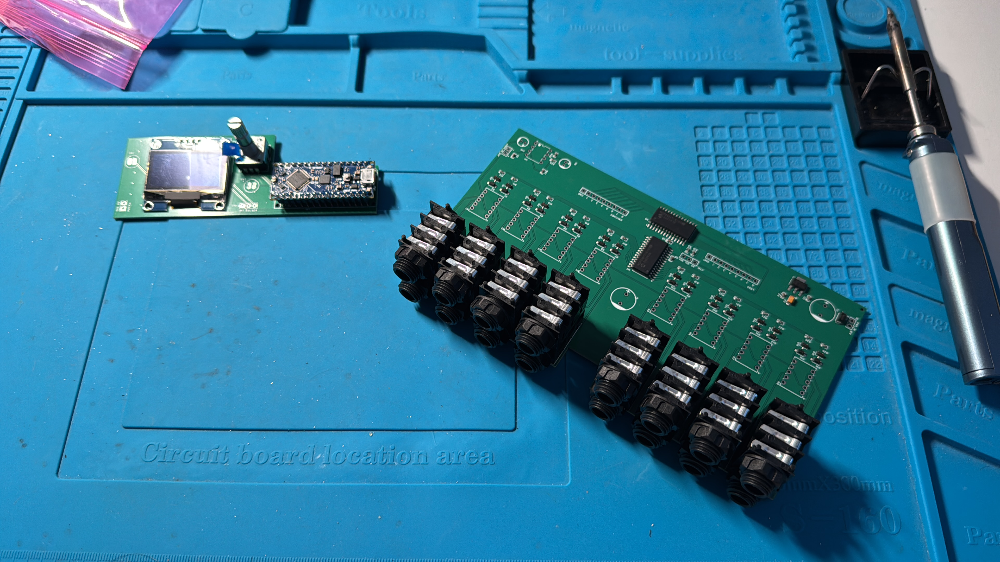

**Note*: The images in this guide currently do not include the MIDI output pins or TRS socket, as this was added in a subsequent revision.

## 2. Order the additional parts

These are generally through-hole components and wires that need to be hand-soldered to the PCBs.

For the control PCB:

- 1 x [Arduino Nano Every](https://www.amazon.co.uk/dp/B07WWK29XF?ref=nb_sb_ss_w_as-reorder_k0_1_18&amp=&crid=K8FPMY45GMY7&sprefix=arduino%2Bnano%2Bevery&th=1) – the brains of the operation. You probably want one with headers pre-soldered, but note that there won't be enough space for female sockets on the PCB and male pins on the Arduino. You'll need to solder it directly to the board.
- 1 x [1.3" OLED module](https://www.amazon.co.uk/dp/B07QJ4LGC2?ref=ppx_yo2ov_dt_b_fed_asin_title) - it's important to get one in this form factor, with four pins - GND, VCC, SCL, and SDA - in the correct order, using the SH1106 chip and the I2C interface. (You may find others with the same footprint but with GND and VCC the other way around, which won't work.)
- 1 x [Bourns PEC11R-4220K-S0024](https://www.rapidonline.com/bourns-pec11r-4220k-s0024-rotary-encoder-robust-compact-high-reliability-08-6435) - a rotary encoder with a click button, used to navigate the menu system.
- 1 x [knob for the rotary encoder](https://www.taydaelectronics.com/black-micro-knob-7-6x14mm-shaft-6x18t.html) - this one is nice and small, but other options are available!
- 2 x [C&K 8631ZGD2](https://www.rapidonline.com/c-k-switches-8631zgd2-pushbutton-switch-spst-120v-28v-500ma-panel-mount-08-7116) - subminiature momentary switches, used for the "Mode" and "Back" buttons.
- 1 x [3.5mm TRS socket](https://www.taydaelectronics.com/22665-dup-black-wqp-wqp518ma-3-5mm-mono-phone-jack-with-nut.html) - used for the MIDI output; you can skip this if you don't want MIDI.

For the audio PCB:

- 8 x [Panasonic TQ2-L2-5V](https://www.rapidonline.com/panasonic-tq2-l2-5v-1a-5vdc-dpdt-2-coil-latching-pcb-signal-relay-low-profile-60-1308) - the dual-coil latching relays used to switch the loops in and out
- 2 x [470uF 10x16mm radial electrolytic capacitors](https://www.taydaelectronics.com/470uf-35v-105c-jrb-radial-electrolytic-capacitor.html) - used for power regulation
- 2 x [10uF 5x11mm radial electrolytic capacitors](https://www.taydaelectronics.com/10uf-25v-105c-jrb-radial-electrolytic-capacitor-5x11mm.html) - used as part of the audio buffer circuit
- 1 x [TL072CP dual op-amp](https://www.taydaelectronics.com/tl072-low-noise-j-fet-dual-op-amp-ic.html) and a suitable [PDIP-8 socket](https://www.taydaelectronics.com/8-pin-dip-ic-socket-adaptor-solder-type.html) - again for the audio buffer circuit

Enclosure and outboard components:

- 2 x [1/4" insulated mono jack](https://www.taydaelectronics.com/6-35mm-1-4-mono-insulated-switched-socket-jack-solder-lugs.html) - used for the main audio input and output connections
- 1 x [2.1mm DC power jack](https://www.taydaelectronics.com/dc-power-jack-2-1mm-enclosed-frame-with-switch.html) - used for 9V centre-negative "pedal" power

- 8 x [SPST momentary switches](https://www.taydaelectronics.com/spst-momentary-soft-touch-push-button-stomp-foots-pedal-switch.html) - the main footswitches. If you are using the suggested drill template, you'll need long-shaft ones because of the LED rings. A low profile is also helpful - it's a tight fit.
- 8 x [Daier LH-12 LED rings](https://www.taydaelectronics.com/lh-12-indicator-lamps-white-color-5-12v.html) in any combination of colours. These particular LEDs go around the footswitch shaft, and the drill template includes extra holes for its wires. These also have a built-in current-limiting resistor.

Other parts:

- 2 x [9-pin single-row 2.54mm male headers](https://www.taydaelectronics.com/9-pin-2-54-mm-single-row-pin-header-strip.html) - used for the LED and footswitch connections. You can also solder wires directly to the board, but with headers you can use Dupont wires for the connections, which is much easier.
- 1 x 3.5 mm TRS jack for MIDI OUT, plus 2 x 220 ohm resistors (1/4 W is ample).
- 4 x 2-pin single-row 2.54mm male headers. Used for 9V and audio connections, if desired. You can also solder directly to the through-hole pads. You may need angled headers for the control PCB 9V connection.
- [Dupont jumper wires](https://www.amazon.co.uk/ELEGOO-Multicolored-Compatible-Arduino-Projects-Yellow-White-Green-Red-Black/dp/B01EV70C78/ref=sr_1_2_sspa) - useful for wiring the boards together.
- Regular wire for the input and output jacks and foot switches.

## 3. Order the enclosure

1. Use the [Tayda Drill Tool](https://drill.taydakits.com) to create a 1590D enclosure (make sure you don't use a 1590DD!). Black Matt Sand texture will work well if you plan to use the included UV design template.
2. Add the drilling option and upload [Tayda/35910_1590D_loop-switcher.txt](Tayda/35910_1590D_loop-switcher.txt) as the drill template. You can also use [this link](https://drill.taydakits.com/box-designs/new?public_key=TldsdmsrbC9LejlTRU5uY0tKVXJZUT09Cg==).
3. You can create your own design, or use the [UV design template](Tayda/Loop%20switcher.pdf) included here. Make sure you apply a white undercoat and the "matte" varnish/gloss overcoat.

## 4. Assemble

Once all the components arrive, you can start the assembly. It's a tight fit and it pays to take your time and check each step carefully.

### 4.1. The control PCB

You need to solder the Arduino Nano Every to the top of the control PCB. The USB socket should point to the right when looking at the silk screen side, i.e. away from the screen. There won't be space for a row of female header sockets, so you need to solder the Nano's headers directly to the PCB.

Next, insert the rotary encoder. It should snap into place. Don't solder it yet - it's important to do a test fit. Remove the nut and washer.

Remove the nuts from the two switches. Try to thread them through the enclosure and fix with the supplied nut. This might not work – the threaded bushing is likely slightly too short.

The solution to this is to _carefully_ remove a bit of material from the inside of the enclosure. Place the enclosure upside down on a soft surface (to avoid scratching the UV design) and _carefully_ use a 10 mm or larger metal drill bit to enlarge and deepen the inside of the two small holes for the "Back" and "Mode" buttons. You want to drill half a millimetre, then check, then drill more if necessary. You definitely don't want to go all the way through, and if you go too far you'll struggle to insert the switch legs into the PCB. Once you are just about able to get the nut on securely, stop. Leave the switches in the enclosure, with the legs oriented vertically in the way they will insert into the PCB (it doesn't matter which is left or right).

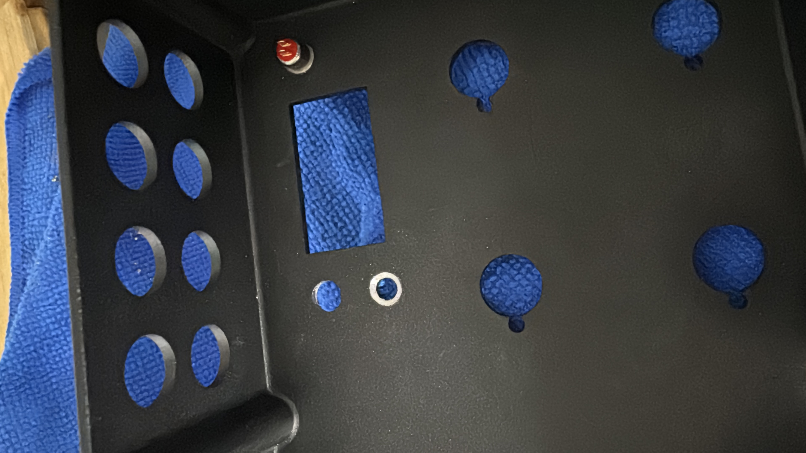

Next, put the OLED through the holes, but do not solder. If possible, insert short standoffs or other material underneath where the mounting screw holes are to prop it into place. You want to position it so that its top surface is exactly the same height as the height of the rotary encoder. Definitely it should not protrude any taller.

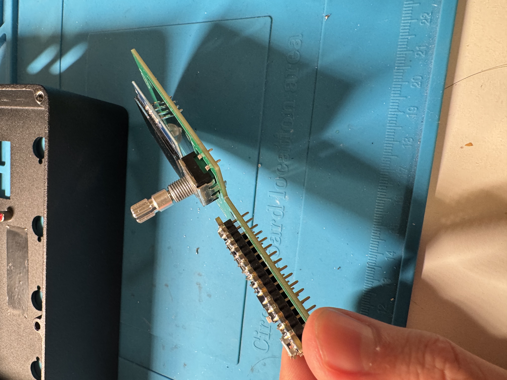

Put some electrical tape on the inside of the enclosure where the Arduino will go. This is just in case you accidentally short something when pushing everything into place (it may not be necessary). Now _carefully_ push the rotary encoder through its hole and line up the PCB with the legs of the two switches. They need to go through the PCB pads. Some wiggling may be required, but don't bend them.

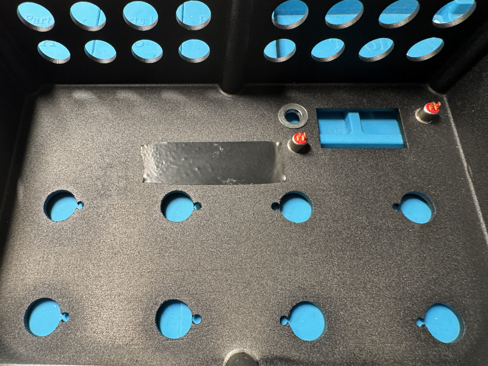

Check from the other side that the screen is aligned with its cutout and everything is in place. It might be necessary to take the OLED out and gently bend its legs to move it up or down a millimetre or two, depending on which manufacturer you ordered from.

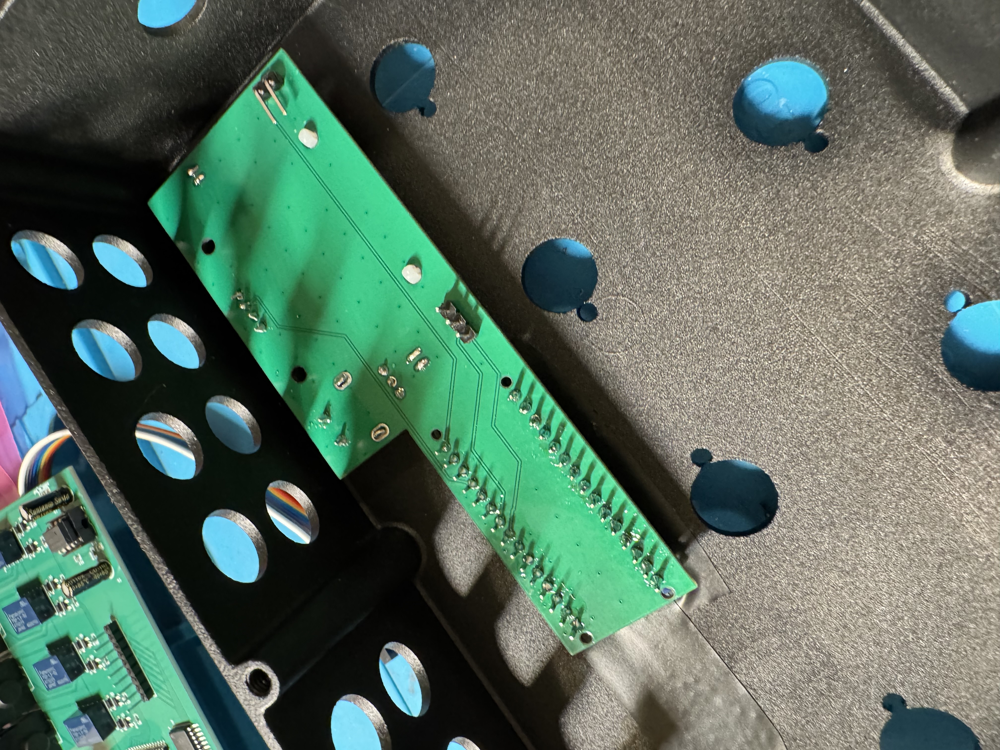

Once you are happy everything is in place, solder the switches, rotary, and OLED pins into place whilst the PCB is still in the enclosure. Check multiple times that nothing has moved out of position and be sure that the switch pins are actually touching the PCB pads. The switches will likely protrude slightly from the top of the PCB.

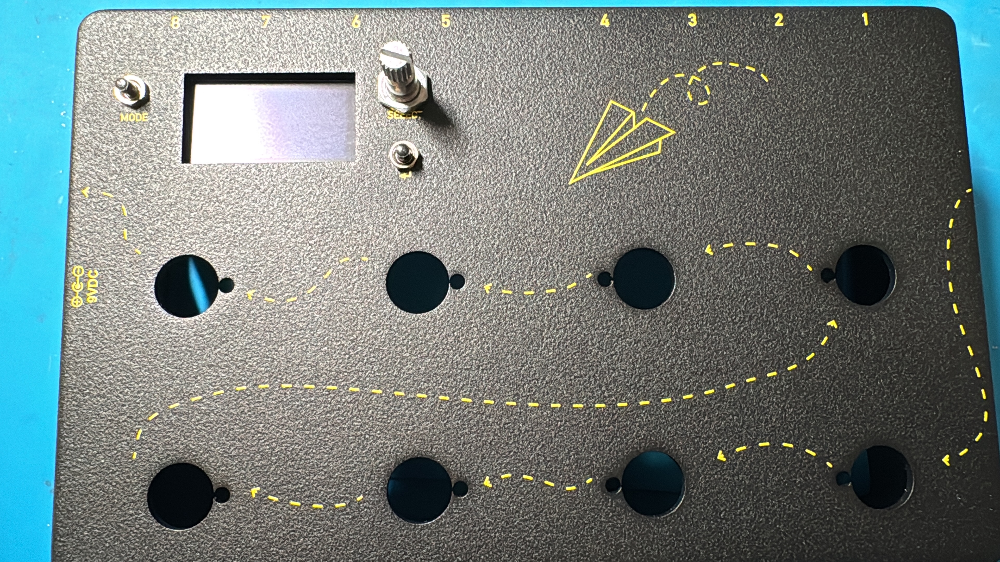

Take everything out of the enclosure. If using header pins, solder these to the _bottom_ of the PCB (this is the only time you'll solder something to the bottom of either PCB). It is a good idea to use angled pins at least for the 9V power. Make a note of which pin is which (there is no silk screen on the bottom) so you don't reverse polarity later and risk blowing up the Arduino or OLED. (The ground connection is towards the outer edge of the board.)

MIDI out support is optional (you can disable it in the firmware). If you are using it, insert two 220 ohm resistors in R1 and R2 on the board and add an (angled) three-pin male header to H3 on the underside. H3 is already after these resistors, so do not add another pair when wiring from H3.

At this point, you can connect the PCB via USB and flash the firmware (see below). The menu system should work (but may display some error messages since it won't be communicating with the relays or switches).

### 4.2. Audio PCB through-hole components and wiring

Solder the electrolytic capacitors to the top of the board. C1 and C7 are the larger 470uF capacitors, and C9 and C10 are the 10uF caps. Be careful – electrolytic capacitors are polarised. The longer leg needs to go into the pad marked +, and the "stripe" side should be on the other pad. Snip the legs close underneath to avoid shorting to the enclosure lid.

Next insert each of the relays. The "stripe" side is up, towards the jacks. Solder all pins into place. It's best to solder one pin first and check the relay is properly seated before soldering the others.

Next, insert rows of 9 male header pins into the footswitch and LED pads. You can solder the wires in directly, but it's much easier to be able to disconnect and reconnect the board. Solder a single pin first, and ensure the whole row is soldered perpendicularly to the board, then do the rest.

Repeat this process for the row of three pins labelled "INT SCL SDA". This row matches the equivalent row on the control PCB, and it is helpful to know that the pins are also in the same order from left to right on both boards. These wires allow the control PCB to manage the relays and LEDs and receive footswitch inputs.

If you want, do the same for the 9V power.

I recommend soldering wires directly to the pads for the audio input and output. You have a choice on the input – there is a pair of pads for the buffered input (i.e. the signal will pass into an always-on buffer), as well as one that bypasses the buffer (so the pedal is "true bypass"). I recommend using the buffered version, as this is likely to preserve your signal better. Solder the other end of the wires to the two isolated jacks (main input, main output). The pad labelled "+" goes to the _tip_ of the jack (furthest in) and the one labelled "-" goes to the sleeve (furthest out). If you have switched jacks, make sure you don't accidentally wire to the switched side.

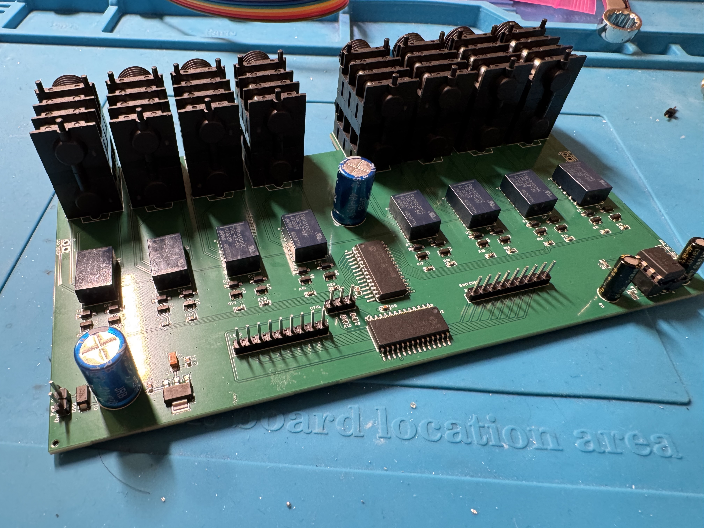

### 4.3. Footswitches, LEDs, and power.

Thread the wires of the LED rings through the small holes from the outside, and the footswitches through the large holes from the inside, and secure with the footswitch nut. Be careful not to over-tighten, as the plastic LED ring housings can be crushed. Orient the footswitches in two rows inside.

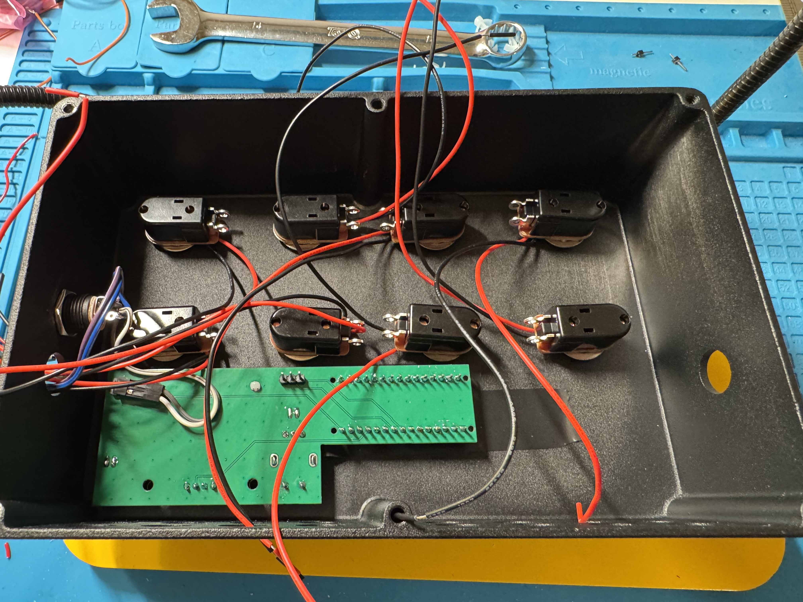

You now need to ensure that one side (it doesn't matter which) of each footswitch is connected to ground, and the other is connected to the correct pin on the row of headers labelled "switches". Similarly, the black wire on each LED ring needs to connect to ground, and the red wire to the corresponding row of headers labelled "LEDs".

One way to do this, is to run a ground bus wire (i.e. a stripped solid-core wire) through one side of each switch, and then run a single wire from the ground bus to a Dupont connector that can be inserted to the GND pin on the switches header row. You can then shorten, strip, and solder the black LED wires to the ground bus at the corresponding switch. This is much neater than running 16 ground wires to the board.

For the other side of the footswitch, you can use (or make) an 8-way Dupont ribbon cable that connects to the header row and fans out to each switch. This helps ensure the switches are all connected to the correct pins in the correct order. Of course, there's nothing wrong with using eight individual wires either.

Similarly, the red LED wires can be crimped to an 8-way female Dupont connector for use on the LED header.

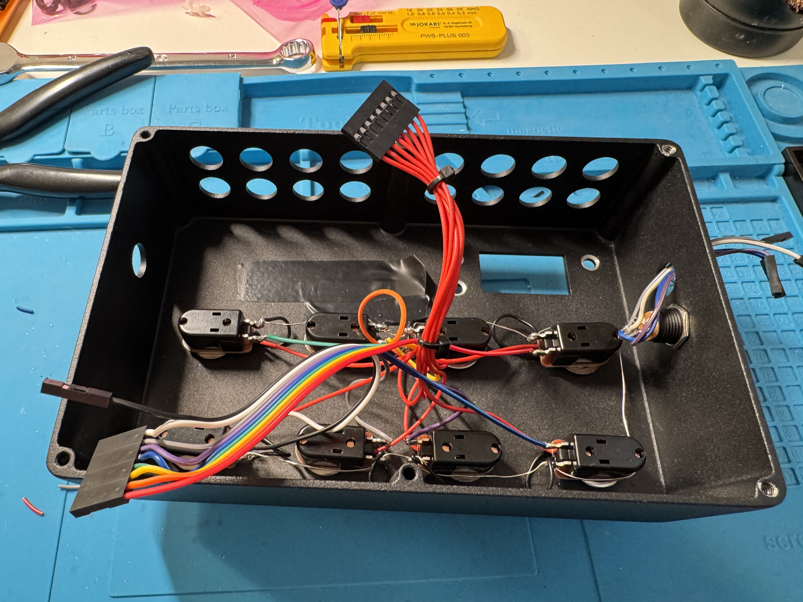

Note that if you do it this way, you may have an unused GND pin, since the LED grounds are tied to the ground bus. You do need to ensure the ground bus is connected to one of the GND pins though!

For the 9V power socket, ensure you know which side is ground and which is +9V, and solder in two wires to each. If using header pins, use Dupont wires and keep them in two pairs so you don't get them mixed up. Use sensible colours to distinguish ground from +9V. You don't want to reverse them!

For the MIDI socket (if using), connect three wires to the ring, tip, and sleeve. The tip carries TX, the ring carries +5V, and the sleeve is ground. H3's TX and +5V pins are already resistor-limited by R1 and R2.

### 4.4. Putting it all together

With all the elements soldered, it is worth using a multimeter to run suitable continuity checks. Look for shorts and any cold solder joints or missing connections.

Insert the power jack first. The jack threads in from the outside, but the nut needs to run over the wires and in from the back. Tighten it in place, but be careful not to ruin the plastic thread. Be certain you know which wires are ground and which are +9V.

Insert the MIDI socket (3.5mm TRS).

Insert the control PCB. Check the alignment and then tighten the nuts on the encoder and two switches. Don't overtighten, but make sure it is secure. The screen should not move when the buttons are pushed. Confirm the orientation and connect the 9V power cables. You can connect a 9V battery or power supply briefly to check that the screen and controls are working before you proceed further.

Connect the wires from the MIDI socket (if using). The pins are GND (square pad), which goes the TRS _sleeve_ (furthest out), +5V (middle) which goes to the TRS _ring_ (middle), and TX, which goes to the TRS _tip_ (furthest inside the enclosure).

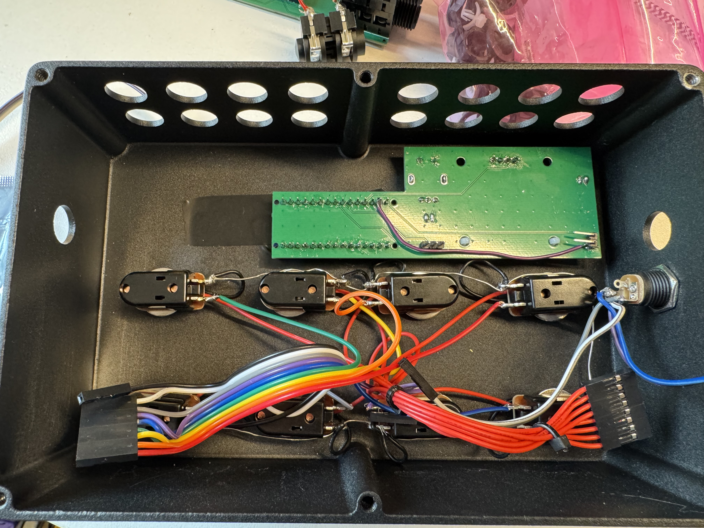

Note that even in this position, it is possible to insert a USB cable, should you need to re-flash the firmware, but once the audio PCB is inserted, it will be difficult to remove it. It is therefore helpful to test the device with the audio PCB outside the box. If you used Dupont connector jumper wires of suitable length, this should be relatively easy.

Connect the various cables to the audio PCB. Carefully check that everything is in place and look for any shorts or missing connections. You should have:

- Power - GND and +9V (confirm orientation!)
- Audio input (buffered or true bypass) and output (likely soldered in place)
- The three control wires - INT, SCL, and SDA, in that order from left to right - running to the corresponding pins on the control PCB.
- One ground wire from the footswitch/LED harness to either GND pin on the footswitches/LEDs header rows
- Eight wires running from LED anodes (red wires) to the 8 LED pins. Check that you haven't accidentally connected the first one to the GND pin.
- Eight wires running from the footswitches to the 8 footswitch pins. Again, confirm the right switch is connected to the numbered pin, noting they run from 8 to 1 left-to-right.

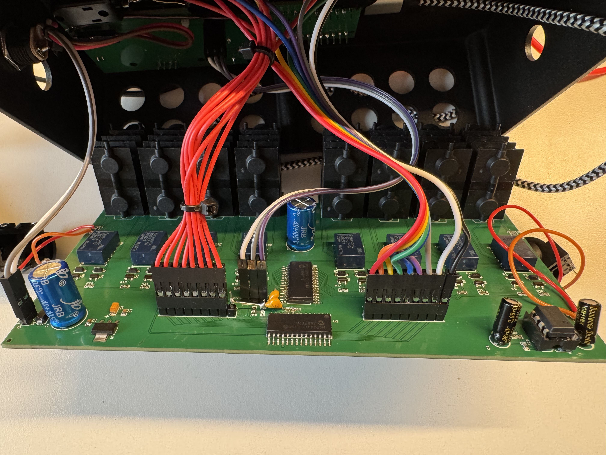

Assuming an initial test looks fine, it's time to insert everything and tighten the outside nuts for the input and output jacks and the eight stacked loop jacks. Do this carefully, as it can be fiddly and you could accidentally bend a header pin or disconnect/snap a wire. You may need to partially insert the audio PCB through the loop jack cutouts, and then push the side jacks into place underneath. Some fiddling will certainly be required.

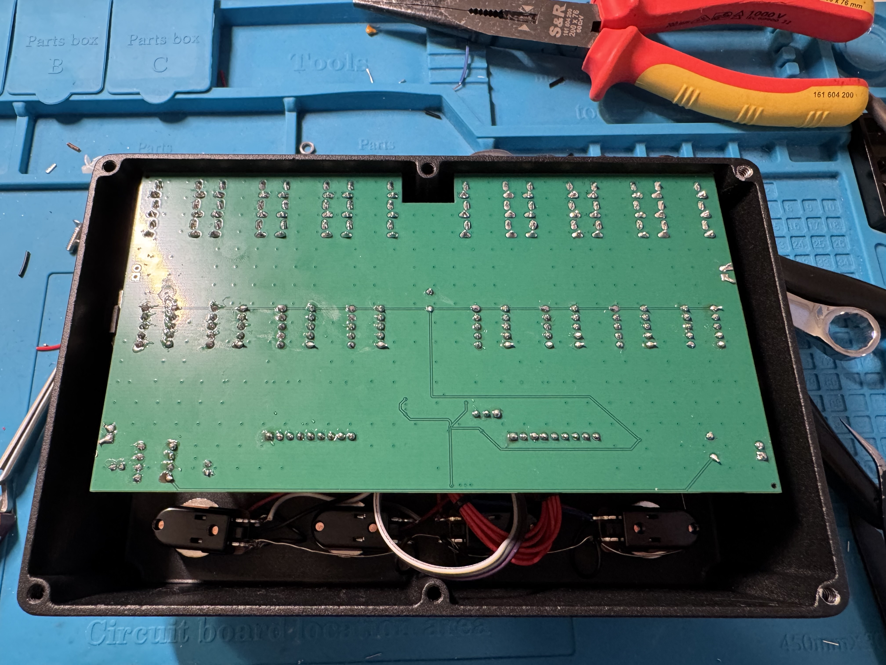

The final step is to put the bottom lid on and connect the unit up. Hopefully everything works! But if not, take your time, check each element carefully. Use a multimeter to test for continuity and look for bad solder joints where you've hand-soldered something.

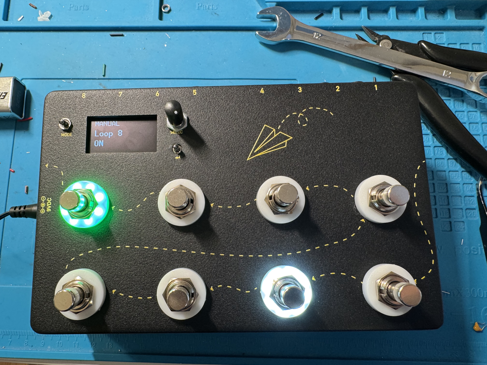

## 5. Build and flash the firmware

**Note** – you need to do this before finalising the assembly, as you can't connect the USB socket after the pedal is fully put together.

Requires [PlatformIO](https://platformio.org) (CLI or the VS Code extension).

```sh
pio run -e nano_every                 # build
pio run -e nano_every -t upload       # flash over USB
PLATFORMIO_BUILD_FLAGS="-Iinclude -std=gnu++17 -fno-sized-deallocation -DLOOPSWITCHER_ENABLE_MIDI=0" pio run -e nano_every  # build without MIDI OUT
pio device monitor                    # 115200 baud boot report in a no-MIDI build
pio test -e native                    # unit tests on the host
```

### MIDI OUT wiring

The MIDI-enabled firmware uses the Nano Every's D1/TX hardware UART at 31,250 baud. Wire a **Type-A** TRS jack as follows:

| Nano Every / TRS | Connection |
|---|---|
| D1/TX | 220 ohm resistor to TRS Tip (DIN MIDI pin 5) |
| +5V | 220 ohm resistor to TRS Ring (DIN MIDI pin 4) |
| Sleeve | DIN MIDI pin 2; handle shield/chassis grounding to suit the jack and enclosure |

This is the MIDI OUT current-loop circuit; no extra active component is required. The table describes wiring from raw Nano pins. On the 2026-10-06 control PCB, use H3's GND, +5V, and TX pins directly for Sleeve, Ring, and Tip: R1/R2 are already in series, so do not add external resistors as well. Confirm that the multi-effects pedal uses Type-A TRS MIDI. Type B needs an adapter or different wiring. D1/TX is also connected to the USB serial interface, so MIDI builds do not print boot text; disconnect the MIDI cable while uploading firmware to avoid sending bootloader traffic to the pedal.

Each preset's `MIDI` menu can independently enable Bank Select (CC0/CC32), Program Change, and one effect CC. When enabled, messages are sent in that order on the preset's MIDI channel. The build-flag command above omits the MIDI transmitter and editor and restores the 115200 baud boot report.

### Bring-up

Before flashing the full firmware, check the hardware step by step with the test sketches. Each is a PlatformIO environment, flashed with `pio run -e <env> -t upload` and driven from the serial monitor at 115200 baud.

| Environment | Checks |
|---|---|
| `i2c_probe` | I2C scan, the audio PCB's expander, footswitches and LEDs |
| `bringup` | Relays: toggle, walk, and many-at-once switching (watch the 5 V rail) |
| `ui_demo` | OLED, encoder, **Mode** and **Back** buttons |
| `eeprom_demo` | Preset storage on the real EEPROM |
| `ops_demo` | The finished UI on the control board alone, with simulated relays and LEDs |

The boot report on the serial port of the final firmware says whether storage, relays and the footswitch expander were found, and whether the last reset came from the watchdog.

## Usage

- **Mode** cycles Manual, Preset and Perform. **Back** returns from a menu.
- Press the encoder on the play screen to open the menu: `PRESETS` (save loops, rename, delete, and configure MIDI for used presets) and `LOOP NAMES`.
- To change a preset's loops, set them in Manual mode and save them into its slot.

<!-- TODO: usage walkthrough with images -->

## Further reading

Design details are in [CAPABILITY-MAP.md](CAPABILITY-MAP.md) and the `SPEC-*.md` files.
